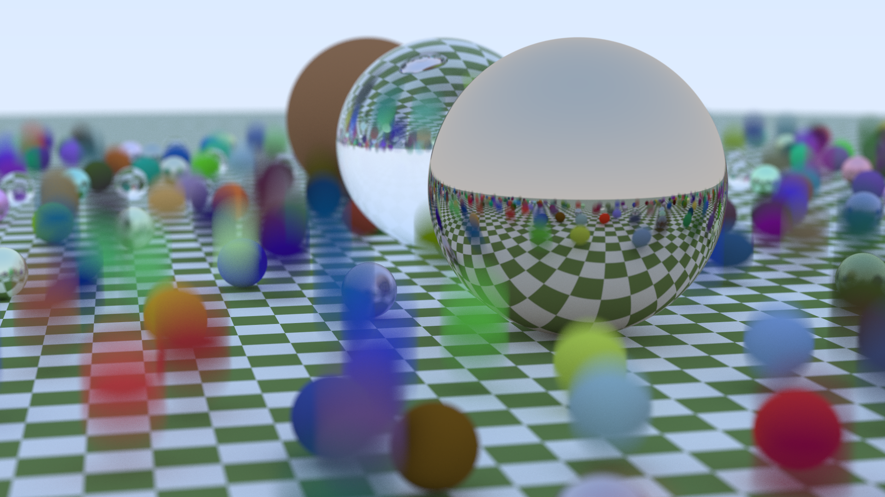
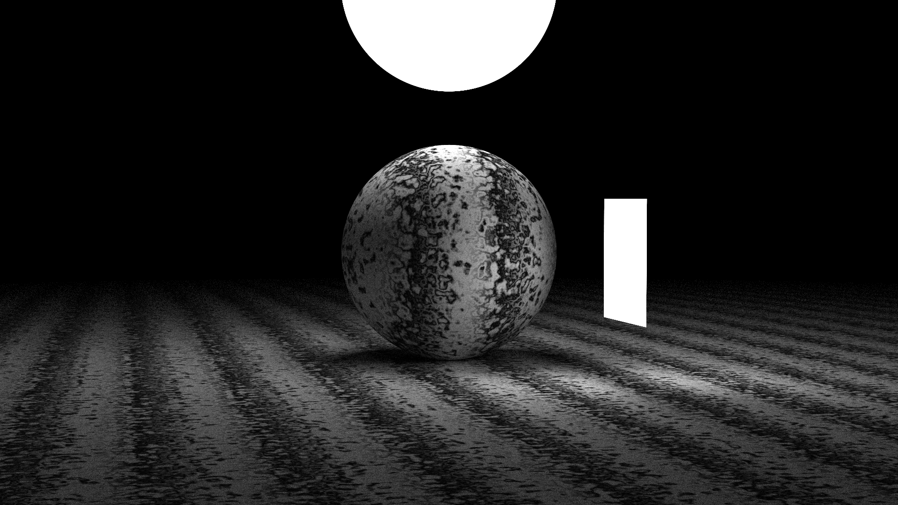

# Raytracer

A simple C++ Raytracer based on "Ray Tracing in One Weekend" book.








## Features

* Raytracing sphere and quads geometries with front face detection.
* Positionable camera.
* Antialising.
* Simple diffuse material.
* Lambertian reflection.
* Gamma correction.
* Light scattering.
* Reflectance.
* Fuzzy reflection.
* Refraction with Snell's law.
* Schlick approximation.
* Defocus blur.
* Motion blur.
* Checked textures.
* Perlin noise based textures.
* Diffuse lights.
* Smoke and volume rendering.

## Building

```
mkdir build
cd build
cmake ..
make
```

## Running

```
cd build
./raytracer
```

## Generating Xcode Project

```
mkdir build
cd build
cmake .. -GXcode
```

## MIT License

Copyright 2024 Pedro Jorquera.

Permission is hereby granted, free of charge, to any person obtaining a copy of this software and associated documentation files (the “Software”), to deal in the Software without restriction, including without limitation the rights to use, copy, modify, merge, publish, distribute, sublicense, and/or sell copies of the Software, and to permit persons to whom the Software is furnished to do so, subject to the following conditions:

The above copyright notice and this permission notice shall be included in all copies or substantial portions of the Software.

THE SOFTWARE IS PROVIDED “AS IS”, WITHOUT WARRANTY OF ANY KIND, EXPRESS OR IMPLIED, INCLUDING BUT NOT LIMITED TO THE WARRANTIES OF MERCHANTABILITY, FITNESS FOR A PARTICULAR PURPOSE AND NONINFRINGEMENT. IN NO EVENT SHALL THE AUTHORS OR COPYRIGHT HOLDERS BE LIABLE FOR ANY CLAIM, DAMAGES OR OTHER LIABILITY, WHETHER IN AN ACTION OF CONTRACT, TORT OR OTHERWISE, ARISING FROM, OUT OF OR IN CONNECTION WITH THE SOFTWARE OR THE USE OR OTHER DEALINGS IN THE SOFTWARE.
